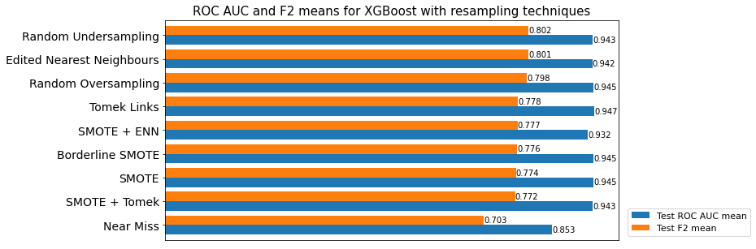
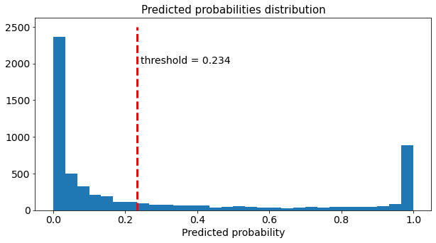

# Credit Risk Modeling
# Introduction
Predicting if a loan will default or not is an important task that financial institutions have to address to minimize their risk of losing money. In this project, I used machine learning techniques to select a model that classifies loans as default or non-default based on a dataset containing various features of the loans themselves. The dataset I used has imbalanced classes, so, in addition to the model selection, I evaluated several resampling techniques and selected the one with the best results. The choice of the final model was guided by the maximization of the profit of the credit portfolio and it was used to create a Heroku app.

You can find the model implementation in the *Model.py* Jupyter notebook inside the *modeling* folder, and all the files related to model deploying in the *deploy* folder.

# Summary of the modeling process

- Two scores were used to select the best model: F2 and ROC AUC (in that order).
- A first model discrimination was performed by estimating the scores of several models without any hyperparameter tuning. This was done for two cases: for data without a resampling technique and for the same data with an oversampling of the minority class. Additionaly, a performance estimation was done for the XGBoost classifier with different resampling techniques.

  

- Three models were selected for further exploration (XGBoostClassifier, GradientBoostingClassifier and RandomForestClassifier). We also selected the Random Undersampling technique as the best resampling technique. A hyperparameter tuning was performed for the three classifiers and the XGBoostClassifier with customized hyperparameters was chosen as the best one.
- A threshold for this selected model was chosen to maximize the profit percentage.

  

- Finally, the selected model was evaluated with the test set and it was seen that its performace it is accordance with the performace estimation of the model. The true profit percentage obtained was very satisfying whe compared with the optimal profit percentage.

# Results
We obtain that performing a random undersampling technique to the imbalanced data of credit risk, using it to train a XGBoost Classifier with customized hyperparameters and setting a threshold of 0.23 is the best strategy to maximize profits in a credit risk portfolio.

The model ensures a profit percentage of 4.213 % +- 0.571 %. In comparison, if all the loans had been accepted, 16.4 % would have been lost.

# Deploying
I used the final model to build an app that predicts if a loan request will be accepted or denied based on some input information. The app is containerized in Docker and hosted on Heroku. You can find it <a href="https://loan-acceptance-predictor.herokuapp.com">here</a>.

**Connect with me at <a href="https://www.linkedin.com/in/carlos-bautista-ch/">LinkedIn</a>**
